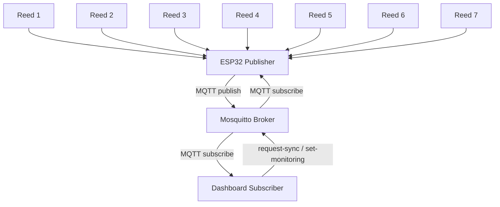

# Reporte Técnico

## 1. Resumen

Se desarrolló un sistema IoT para supervisar la apertura de siete compartimentos mediante sensores `reed switch`. La solución usa un `ESP32` como nodo publicador, `Eclipse Mosquitto` como broker MQTT y una aplicación web en Python como nodo suscriptor y actuador digital.

## 2. Objetivo

Implementar una arquitectura MQTT robusta y modular que permita:

- adquisición en tiempo real del estado de siete compartimentos
- publicación de eventos y resumen general al broker
- reacción del suscriptor mediante alarma digital e interfaz de monitoreo
- operación portable mediante `Docker Compose`

## 3. Arquitectura del sistema



## 4. Topología de red

- Red WiFi del laboratorio: `SoriaDG`
- Nodo publisher: `ESP32`
- Nodo broker: `Raspberry Pi` o `BeagleBone`
- Nodo subscriber: laptop o SBC con navegador

## 5. Árbol de tópicos MQTT

```text
escom/iot/equipo7/reed-monitor/
├── publisher/status
├── sensor/summary
├── sensor/heartbeat
├── sensor/compartment/1..7
├── command/request-sync
├── command/set-monitoring
├── actuator/alarm
└── subscriber/status
```

## 6. QoS utilizado

- `publisher/status`: `QoS 1`, retenido
- `subscriber/status`: `QoS 1`, retenido
- `sensor/summary`: `QoS 1`
- `sensor/compartment/#`: `QoS 1`
- `command/#`: `QoS 1`
- `actuator/alarm`: `QoS 1`, retenido

Se eligió `QoS 1` porque el estado de apertura/cierre no debe perderse, pero tampoco se requiere la sobrecarga adicional de `QoS 2`.

## 7. Decisiones de diseño

- Se usó `INPUT_PULLUP` para simplificar el cableado de los `reed switch`.
- El `ESP32` publica eventos individuales y también un resumen global.
- El dashboard funciona como suscriptor y actuador digital, cumpliendo con la reacción a eventos sin depender de otro hardware adicional.
- Se agregó `Docker Compose` para portar el broker y el dashboard con mínima configuración.

## 8. Flujo de operación

1. El `ESP32` detecta un cambio en uno de los siete reed switch.
2. Publica el evento en `sensor/compartment/<id>`.
3. Publica un resumen en `sensor/summary`.
4. El dashboard recibe el evento desde Mosquitto.
5. El sistema activa una alarma digital y resalta los compartimentos abiertos.
6. El operador puede reconocer la alarma o solicitar una resincronización.

## 9. Evidencia de conectividad

### Comandos sugeridos

```bash
ping -c 4 <ip-del-broker>
mosquitto_sub -h <ip-del-broker> -t 'escom/iot/equipo7/reed-monitor/#' -v
```

### Tabla para resultados medidos en laboratorio

| Prueba | Resultado esperado | Resultado medido |
|---|---|---|
| Ping al broker | Respuesta estable | Pendiente |
| Publicación de apertura | Evento visible en dashboard | Pendiente |
| Publicación de cierre | Estado vuelve a normal | Pendiente |
| Solicitud de sincronización | Reenvío de snapshot | Pendiente |
| Desactivar monitoreo | Alarmas inhibidas | Pendiente |

## 10. Conclusiones

La solución propuesta cumple con la arquitectura MQTT requerida por el proyecto integrador. El sistema mantiene roles claros de `publisher`, `broker` y `subscriber`, además de aportar puntos extra mediante contenedorización y dashboard web. Las mediciones finales de latencia y estabilidad deben registrarse durante la demostración física en laboratorio.

